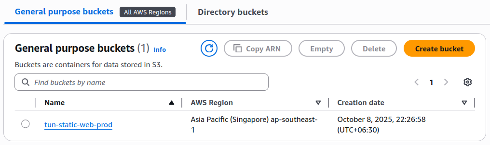
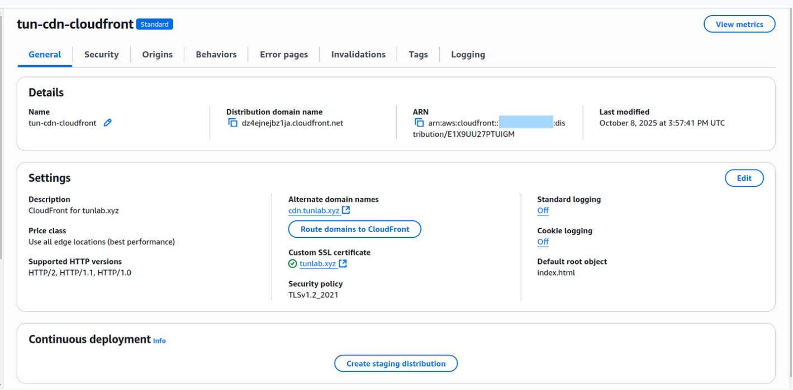

# Static Websites using AWS S3 + CloudFront + SSL

## Overview
Hosting a static website on AWS using S3 (Simple Storage Service) is one of the most cost-effective and low-maintenance solutions available today.
By integratin S3 with CloudFront (CDN) and AWS Certificate Manager (ACM), we can deliver our website securely over HTTPS with reduce latency, and improve global performance.

This setup is ideal for Personal portfolios or blogs, company landing pages, or Product documentation or static web apps.

---

## Architecture Overview

Our goal is to host a static website using:
- Amazon S3 >> to store website files (HTML, CSS, JS, images)
- Amazon CloudFront >> to cache and serve the content globally
- AWS Certificate Manager (ACM) >> to enable HTTPS (SSL/TLS)
- Amazon Route 53  >> to map a custom domain name


## Key Resources 

- ACM Certificate (us-east-1) – required for CloudFront SSL/TLS
- Route 53 – for DNS and domain management
- S3 Bucket – to host static website content
- CloudFront Distribution – to securely deliver content globally with low latency


**Note**:  I have already a public hosted zone in Route53 for Public DNS (tunlab.xyz)

## Review Variables and Provider
```bash
domain_name               = "example.com" # "your root domain"
subject_alternative_names = ["*.example.com"] #["*.your root domain"] # 
prefix                    = "myapp"
environment               = "prod"
cdn_aliases               = ["cdn.example.com"] 
aws_region                = "ap-southeast-1"
aws_profile               = "your aws profile"

```
Also confirm that your AWS providers are configured correctly for:
- us-east-1 (for ACM)
- Your primary region (e.g., ap-southeast-1 for S3, CloudFront, and Route 53)

## Upload Your Website Content

After deploying the infrastructure with Terraform, upload your static files to the S3 bucket:

## Results in console

- ACM Certificate


- S3 Bucket


- CloudFront Distribution


---

After validation and deployment are complete, open your browser and navigate to:
https://cdn.example.com
 (or your custom domain)


### References
- [How CloudFront Works (AWS Docs)](https://docs.aws.amazon.com/AmazonCloudFront/latest/DeveloperGuide/HowCloudFrontWorks.html)

- [CloudFront Features Overview](https://aws.amazon.com/cloudfront/features/)

- [Using Origin Shield with CloudFront](https://docs.aws.amazon.com/AmazonCloudFront/latest/DeveloperGuide/origin-shield.html)
